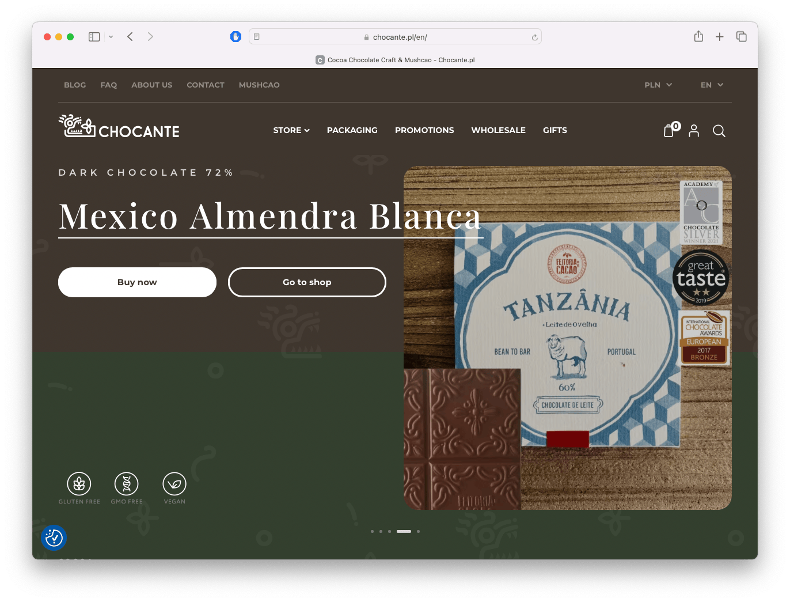

# Chocante — Custom WordPress/WooCommerce Theme

A hybrid theme built for a chocolate e-commerce store.
WordPress (Gutenberg) handles content, WooCommerce runs in classic mode for full template control.



**Advanced caching strategy**  
Full-page cache with LiteSpeed Cache, with separate cache variants per currency, shipping country,
and VAT status. Dynamic fragments (cart, header, mini-cart) served via ESI blocks.
Static assets cached at Cloudflare edge with smart purging via Cache Tags.

**Multi-currency & Multi-language**  
Currency switching with per-currency pricing. Cloudflare Worker handles currency detection
and cache key generation.

**Custom shipping integrations**  
WooCommerce shipping methods with dynamic pricing via BL Paczka and Globkurier APIs,
including pickup point selection.

**Gutenberg blocks**  
Custom info bar block for the editor.

## Structure

```bash
blocks/                           # Gutenberg blocks (wp-scripts)
cloudflare/                       # Cloudflare Worker + wrangler config
includes/                         # Theme functions
├── abilities.php                 # WordPress MCP abilities
├── assets.php                    # Script/style enqueuing, preloading, preconnects
├── blocks.php                    # Gutenberg block functions
├── blpaczka.php                  # BL Paczka API integration
├── cache.php                     # LiteSpeed Cache — ESI blocks, cache tags, cache varies
├── class-assets-handler.php      # Asset versioning and import handler
├── cloudflare.php                # Cloudflare cache tags & smart purging integration
├── crawler.php                   # LiteSpeed crawler
├── currency.php                  # Multi-currency logic
├── feed.php                      # Product feed adjustments
├── gtm.php                       # Stape/GTM server-side tracking
├── layout                        # Page specific hooks
├── location.php                  # Country/VAT detection
├── media.php                     # Image settings
├── menu.php                      # Menu settings
├── plugins.php                   # Plugins asset optimization
├── product-tags.php              # Product tags settings
├── setup.php                     # Theme setup, feature support
├── translations.php              # TranslatePress integration
├── widgets.php                   # Sidebars
└── woo.php                       # WooCommerce — price display, VAT suffix, search
scripts/                          # Per-page JS entry points (cart, checkout, shop, account...)
styles/                           # Per-page SCSS entry points
template-parts/                   # PHP partial templates
woocommerce/                      # WooCommerce template overrides
```

## Scripts

```bash
npm start              # development build (watch)
npm run build          # production build
npm run build:prod     # lint + production build
npm run lint           # lint JS and SCSS
npm run make-theme     # package theme as chocante.zip
npm run make-pot       # generate .pot translation file
```

## Stack
PHP · JavaScript · SCSS  
WordPress · Gutenberg · WooCommerce  
LiteSpeed Cache (ESI, Cache Tags, Vary) · Cloudflare (Workers, Cache API)  
Splide · PhotoSwipe
